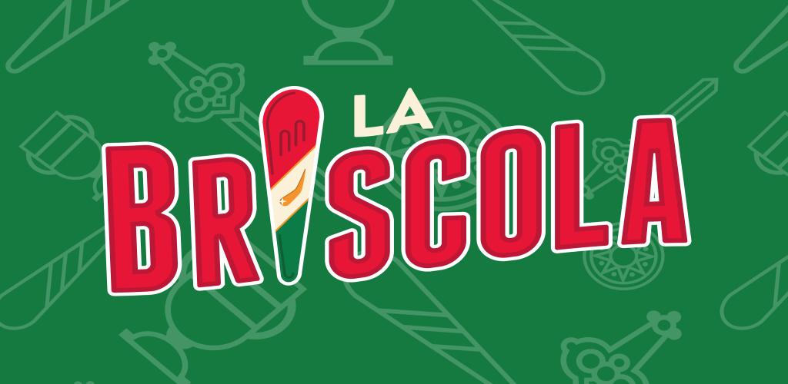

# Briscola!

La Briscola è uno dei più diffusi giochi di carte in Italia e che ha dato origine a numerose varianti.

Si gioca con un mazzo di 40 carte con i valori asso, 2, 3, 4, 5, 6, 7, fante, cavallo, re, di semi italiani o francesi. Si può giocare in due o in quattro, a coppie di due.

Link di Wikipedia al [Gioco della Briscola](https://it.wikipedia.org/wiki/Briscola)
